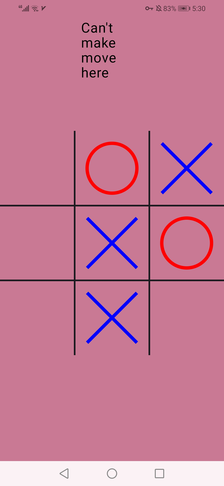
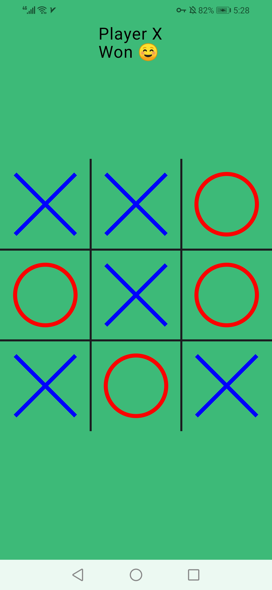
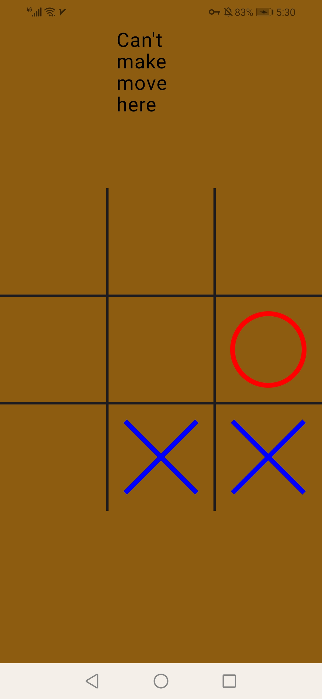

# TicTocToe 

This repository contains a simple yet engaging Tic Tac Toe game built using Kotlin and Jetpack Compose. The project demonstrates modern Android development practices and serves as a great example of using Jetpack Compose for creating a dynamic and responsive UI.

## ScreenShots 

  
  
  

 ## Contributing

  Feel free to fork this repository and submit pull requests.

  ## License

  This project is licensed under the MIT License.

